<!-- <h1 align="center">Hi, I'm Yash Sabale 👋</h1>

  

  

---

### 🚀 What I'm Building

**[CodeOpoly](https://github.com/yashcode247/CodeOpoly)**
A coding-themed take on Monopoly.

**[BudgetWise-AI](https://github.com/yashcode247/BudgetWise-AI)**
An AI-assisted budget planning application.
`Python`

---

### 🛠️ Tech Stack

  
  

---

### 📊 GitHub Stats

  
  

  
  

---

<i>Open to research collaborations and AI/ML opportunities.</i>
 -->

<h1 align="center">Hi, I'm Yash Sabale 👋</h1>

  

  
  

---

### 🎓 About Me

CS student at the **University at Buffalo** (2023–2027), based in Buffalo, NY.
Software Engineer Intern @ ThoughtStorm Inc. · Data Analyst Intern @ Convalida Technologies

---

### 🚀 Projects

**[CodeOpoly](https://github.com/yashcode247/CodeOpoly)** — Real-time multiplayer web app
Built with React, TypeScript, Node.js, and Socket.io, supporting 2–4 concurrent players with live action feeds. Includes a sandboxed code execution pipeline (Docker + Judge0 API) supporting JS, Python, Java, and C++, backed by PostgreSQL and Redis.

**BudgetMax** — Full-stack personal finance web app
Shipped 5+ end-to-end features (subscription management, expense splitting, savings goals, transaction tracking) on a PHP/MySQL + JavaScript stack as part of a 10-person Agile team. Designed RESTful CRUD APIs with session auth, Chart.js visualizations, and live stock data via the Finnhub API.

**[Real-Time ASL Translator](https://github.com/yashcode247/ASL-translator)** — Machine learning
Multi-stage sign language translation system using transfer learning (MobileNetV2) and MediaPipe hand landmark extraction across 29 ASL sign classes. Combines RGB and pose streams for gesture recognition, with GPT-2 for contextual sign-to-English translation.

**Draw it Right** — Computer vision web app
Real-time gesture recognition using OpenCV, MediaPipe, and Streamlit with TensorFlow-based object detection. 🏆 Won *Best Use of Streamlit* at UB Hacking 2024 (30+ teams).

---

### 💼 Experience

**Software Engineer Intern** · ThoughtStorm Inc. (Remote, Canada) · Jun–Aug 2025
Optimized backend modules in Python (−30% data processing time) and cut front-end load time from 4.2s → 2.8s for 150+ active users.

**Data Analyst Intern** · Convalida Technologies (India) · Jun–Aug 2024
Built interactive Power BI dashboards from large datasets using SQL/Python and automated data cleaning workflows.

---

### 🛠️ Tech Stack

  
  
  
  
  
  
  
  

  
  
  
  
  
  
  
  
  

---

### 📊 GitHub Stats

  
  

---

<i>Open to Software Engineering internships/new-grad roles and research collaborations in AI/ML.</i>

